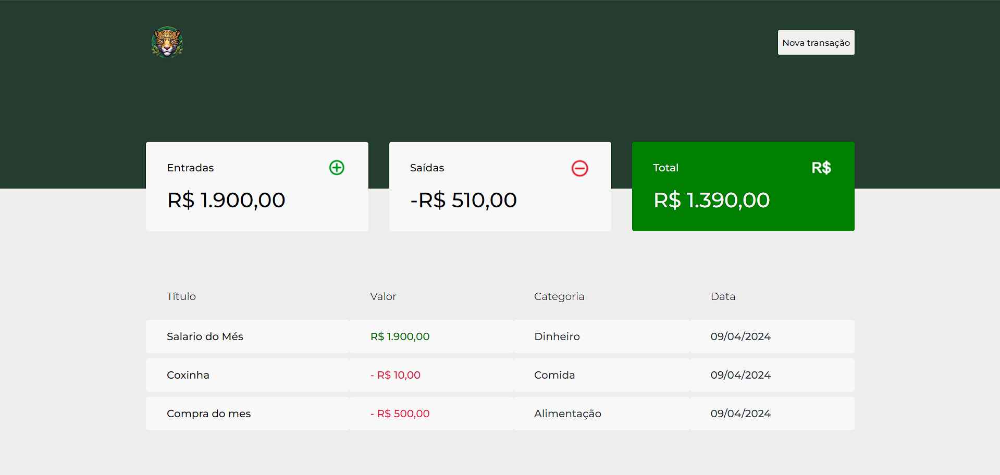
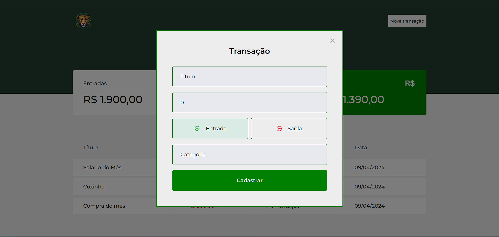

# Controle Financeiro Pessoal - Onces Finances - Harison Rios 💻

>  Page - Imagem 1

>  Page - Imagem 2

## Comentários e Funcionalidades
 
 Projetinho Full-Stack que está sendo desenvolvido para fins comerciais, com a prinicapl função de cadastrar transações de entrada e saída de valores.  
 O projeto ainda está em fase de desenvolvimento e as próximas atualizações serão voltadas nas seguintes tarefas:

- [ ] Criar um Sistema de login e registro 
- [ ] Conectar o MongoBD ao projeto para ter um controle financeiro para cada usuário específico
- [ ] Responsividade de algumas telas
- [ ] Melhorias no style da pagina principal

- [ ] Deploy

## Tecnologias

React  
Next JS  
Typescript   
Axios  
MirageJs  
Context Api  
Styled Components  
Polished React   
React Modal   

 
## 📝 Licença

Esse projeto está sob licença. Veja o arquivo [LICENÇA](LICENSE.md) para mais detalhes.
